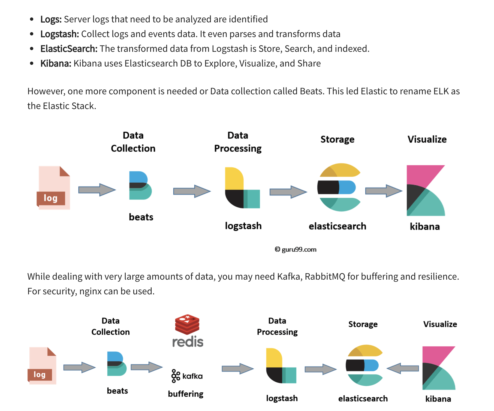

#### ElasticSearch
    It's a distributed full text search engine based on Apache Lucene. It is document oriented and store entire objects in docs.
    Store schema-less data and also creates a schema for your data

    Indices --> Type  --> Documents --> Fields  
    DB   --> Table -->   Rows    --> Cols
    Mapping is schema of ElasticSearch.

#### Inverted Index
    It uses a data structure called an inverted index, which is designed to allow very fast full-text searches. An inverted index lists every unique word that appears in any document and identifies all of the documents each word occurs in.
    During the indexing process, Elasticsearch stores documents and builds an inverted index to make the document data searchable in near real-time. 
    Ex:
	Token  |  Documents
	Mike      3, 4
	Picture   3

#### Elasticsearch::Model::Callbacks
    Ensures elastic search indexes are updated when model is created or updated.

 #### Analyzers
    Elasticsearch has a wide set of Language Analyzers. It use them to parse expressions into constituent terms.
    An analyzer consists of a single tokenizer and any number of token filters. For example, a tokenizer could split a string into specifically defined terms when encountering a specific expression.
    Depending on the data stored within a field, a different analyzer may give better results. Ex: Keyword analyzer for zip codes.

#### Types 
    It supports a lot of Types which includes Array and Objects as well.

#### Shards
    ES index can be split into multiple shards. Number of primary shards are fixed when an index is created. 
    Only replica shards can be changed after index creation and not shards which only affects throughput of cluster and not data storage capabilities.

### Cons:
    No internal security
    Limited support for advanced computation in DB.
    Data availability is weak.
    not durable as backups are not high priority.
    If your application needs to update records frequently, then Elasticsearch may not be the right technology to use

#### Reserved Fields in document
    _index
    _type
    _id

#### Different types of Nodes
    Data Nodes - stores data and executes data-related operations such as search and aggregation

    Master Nodes - handle cluster-wide management and actions such as adding and removing nodes

    Client Nodes - forwards cluster requests to the master node and data nodes

    Tribe Nodes - act as a client node, performing read and write operations against all of the nodes in the cluster
    
    Ingestion Nodes - pre-processing documents before indexing

    ML Nodes - For ML related tasks

    Client node   --- Data o/p --->  Data Nodes
        | 
        |---------- Add/Remove --->  Master Nodes

#### Create a document for an index and type
    POST localhost:9200/index/type/
        
#### Fetch a document for an index, type and provided id
    GET localhost:9200/index/type/{id}

#### Update a document
    Elasticsearch has built-in document versioning. The documents are versioned automatically by starting at version 1 and incrementing by one with each future operation

    PUT localhost:9200/index/type/{id}?version=1

#### search
    _cat API is used to search on an index.
    localhost:9200/_cat/count/{index}?v"

### ELK Stack

