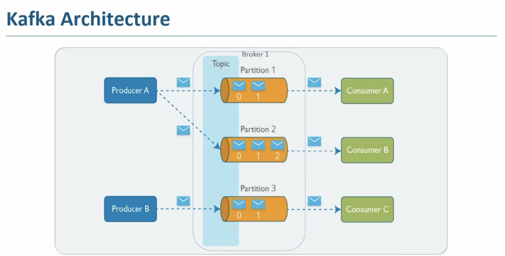

``It is an event streaming platform used to collect, process, store, and integrate data at scale. It models events as key/value pairs. It is a distributed commit log which are splitted into partitions.``

``Each message in a topic is assigned a sequential ID called offset. Writes to a partition are generaly sequential Reading can be from beginnning or direct if offset is provided. Message are written to partition based on a hash key, which tells which partition to write to. (Similar to Consistent Hashing)``

``A Kafka cluster consists of one or more servers (Kafka brokers). Each Broker can have one or more Topics. Kafka topics are divided into a number of partitions, each partition can be placed on a single or separate machine to allow for multiple consumers to read from a topic in parallel. One of those partitions is selected as leader and rest replicas.``

#### Use cases
    Data integration
    Activity Tracking
    Metrics and Monitoring
    Stream processing
    Distributed log aggregation
    Pub/Sub messaging

#### Features
    High Throughput
    Highly distributed systems with no downtime
    No data loss
    Durability - immutable logs
    Replication of log across different brokers.

#### Terms
    Publisher  - Radio Channel

    Subscriber - Radio listeners
    
    Topic - Frequency
    A feed name to which records are published. It is a log of events. Every topic can be configured to expire data after it has reached a certain age. Logs are immutable.

    Partitions - Topics are broken into ordered commit logs called partition.

    Broker - Kafka cluster is a set of servers or nodes called broker (Towers). These may not be separate physical servers but containers running on pods running on virtualized servers running on actual processors in a physical datacenter somewhere

    Zookeper - used for managing and coordinating kafka brokers. Kafka cluster use it to get info. about any failure nodes. It assigns one broker as controller to assign leader partition in case of partition shut down.

#### Pros
    In Kafka, consumer groups provide ordered delivery across an arbitrary number of consumers, so you get horizontal scale in the consuming application with the strongest ordering guarantee possible, while operating at scale.

 Message with same key reside in same partition. 
 Replication ID is same as that of broker.

#### Kafka Architecture

