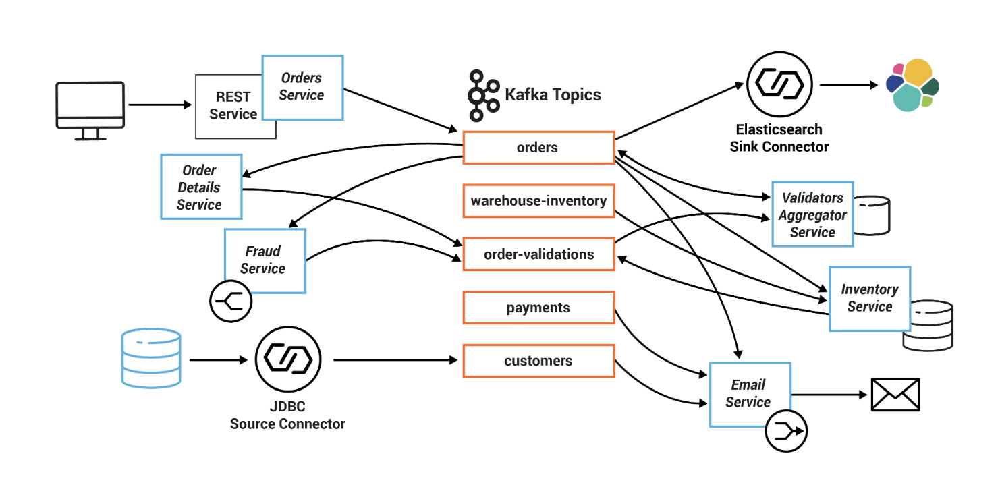

### Monolithic

	Restricted to technology stack.
	Engineering team can't focus on one module.
	DB scalability- we can add read replicas but adding write replicas is a problem.
	Overloaded VM/containers.
	CI/CD  build take more time for a big monolith.
	Code understanding is difficult.

### Microservices

	Scaling, deploy easy
	technology easing and adaptablity to new stacks

#### Cons
	Interprocess communication
	Transactions are distributed like two phased commit, saga
	more resources
	debugging issues.

#### Scaling ways
	Horizontal scaling(X-axis) - Scaling consists of running multiple copies of an application behind a load balancer. If there are N copies then each copy handles 1/N of the load. This is a simple, commonly used approach of scaling an application.
	Functional decomposition (Y-axis) - Interaction and flows service.
	Data partioning - partition data to be handled by different servers.
	

#### API Gateway
	As direct calls to multiple services will incur more time and resource consumption.

#### BFF (Backend for Frontend)
	This means diff. gateway for different types like
	1-  API Gateway for web 
	2 - API Gateway for mobile
	3 - API Gateway for 3rd party(exposing ur own API)

#### Uses of API Gateway
	Authentication - Token based
	SSL Termination like Nginx
	Load Balancing
	Insulation - By using VPC to keep services.

	Other pros
		API health monitoring
		Caching
		Authorization
		API versioning
		A/B tesing

	Cons
		Added latency because of mediator i.e, Gateway
		More complex and extra resource.

#### Service Registry
	To keep track of network address details of all services for communication b/w gateway and services or inter-services

#### Ways for Registry
	Registering itself whenever some new instance is added or go down.
	Service Registry  will ask service based on events related to cluster up/down and ask that service for updated cluster details.

#### InterService Communication
	Syncronous communication - Communicating updates to other microservices. Ex: using REST, gRPC
						AG ---> M1 ---> M2

	Asynchronous communication(Event/Message Driven) - Communicating using queues to other services asynchronously. Use pub/sub pattern. Ex: using Kafka

			AG  |---|  M1 	 |---|  M2
					   |__   |---|  M3
		More faster and no need for service discovery.

#### Client Side Discovery
	When making a request to a service, the client obtains the location of a service instance by querying a Service Registry, which knows the locations of all service instances. This is typically handled by a Microservice chassis framework

	Pros - 
	Fewer moving parts and network hops compared to Server-side

	Cons - 
	This pattern couples the client to the Service Registry
	Need to implement client-side service discovery logic for each programming language/framework

#### Server Side Discovery
	When making a request to a service, the client makes a request via a router (a.k.a load balancer) that runs at a well known location. The router queries a service registry, which might be built into the router, and forwards the request to an available service instance.

	Pros - 
	Client code is simpler since it does not have to deal with discovery
	Some cloud environments provide this functionality like AWS ELB

	Cons - 
	Unless it’s part of the cloud environment, the router must is another system component that must be installed and configured. The router must support the necessary communication protocols 
	More network hops are required

#### Circuit Breaker(Hystrix)
	When one service synchronously invokes another there is always the possibility that the other service is unavailable or is exhibiting such high latency it is essentially unusable. Precious resources such as threads might be consumed in the caller while waiting for the other service to respond. This might lead to resource exhaustion, which would make the calling service unable to handle other requests. The failure of one service can potentially cascade to other services throughout the application.

	Solution - 
	A service client should invoke a remote service via a proxy that functions in a similar fashion to an electrical circuit breaker. When the number of consecutive failures crosses a threshold, the circuit breaker trips, and for the duration of a timeout period all attempts to invoke the remote service will fail immediately. After the timeout expires the circuit breaker allows a limited number of test requests to pass through. If those requests succeed the circuit breaker resumes normal operation. Otherwise, if there is a failure the timeout period begins again.

